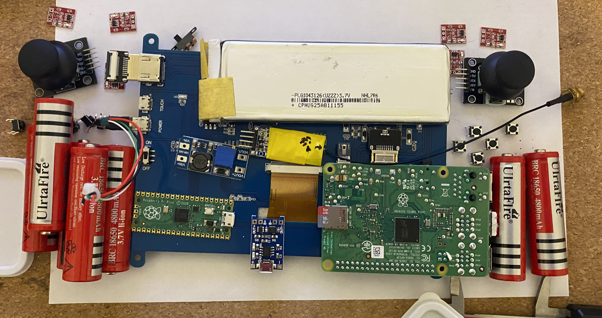
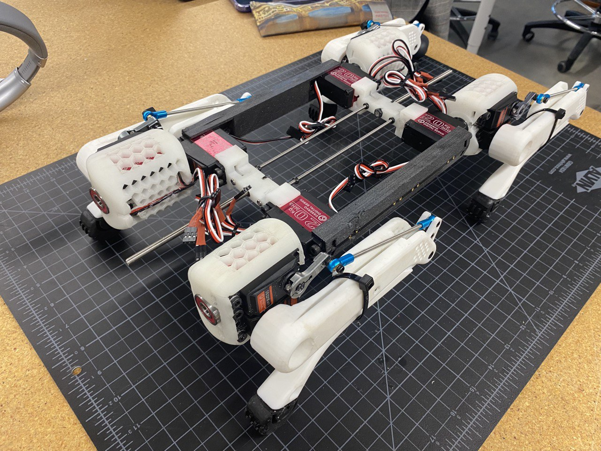
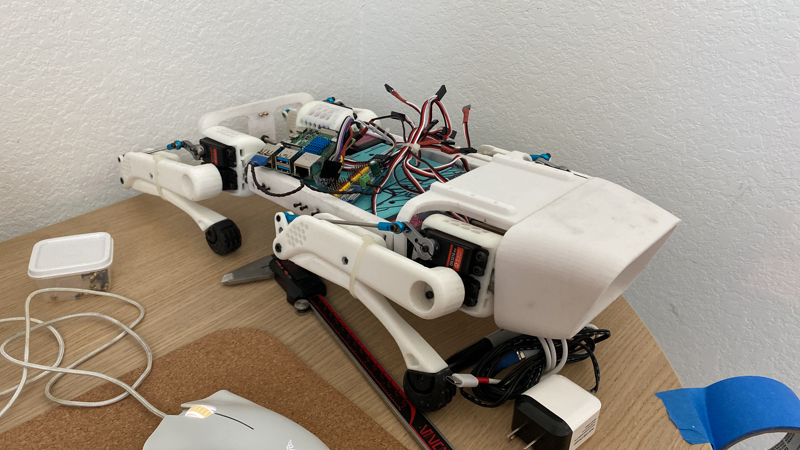

# Gray
A quadruped robot designed and manufactrued by college students from scratch and trained with pyhton reinforcement learning.
## About:

## CAD Modelling:

## Manufacturing:

This is the picture of the Controller we are desiging for the robot

THis is a picture of the legs that we have designed

This is a picture of the main body

This is a picture of the main body combined with the computer systems for testing

## Simulation:
These are couple of Gifs showing the progress that has been done by the machine learning algorithm we are using throughout time.

Currently WIP.

## Contributors:
 - Ibrahim Eren Bisen
 - Emin Alp Arslan
