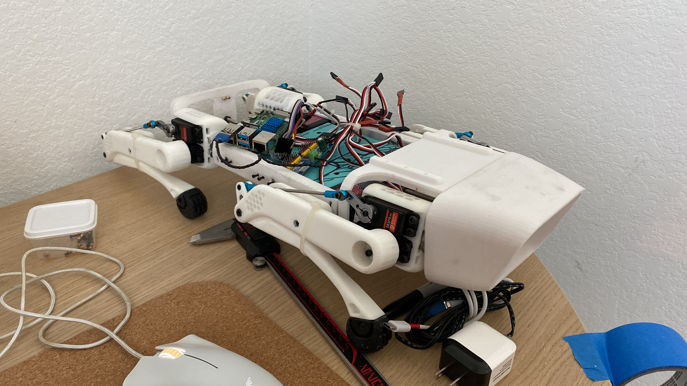
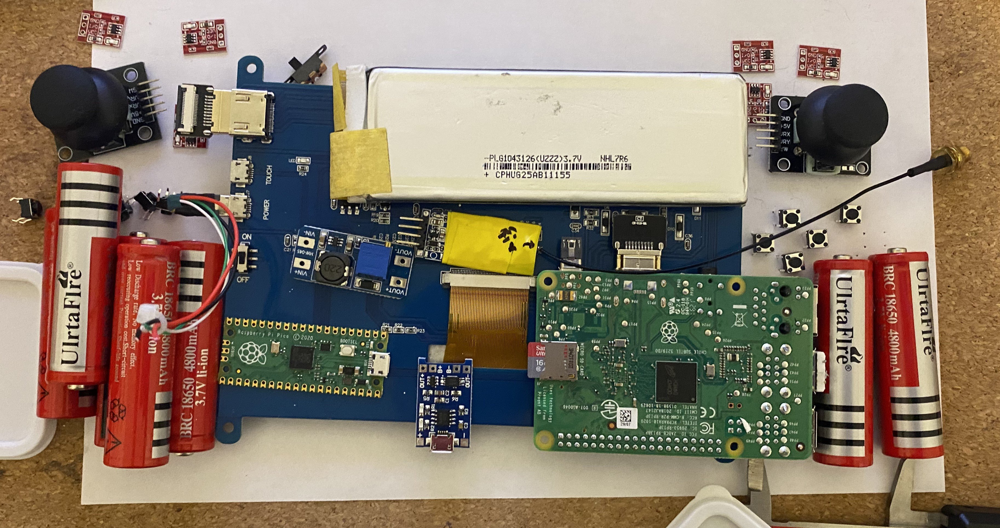
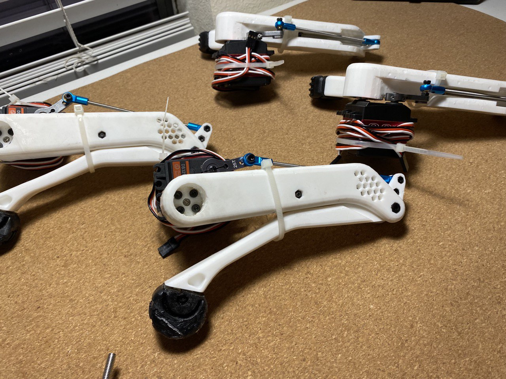
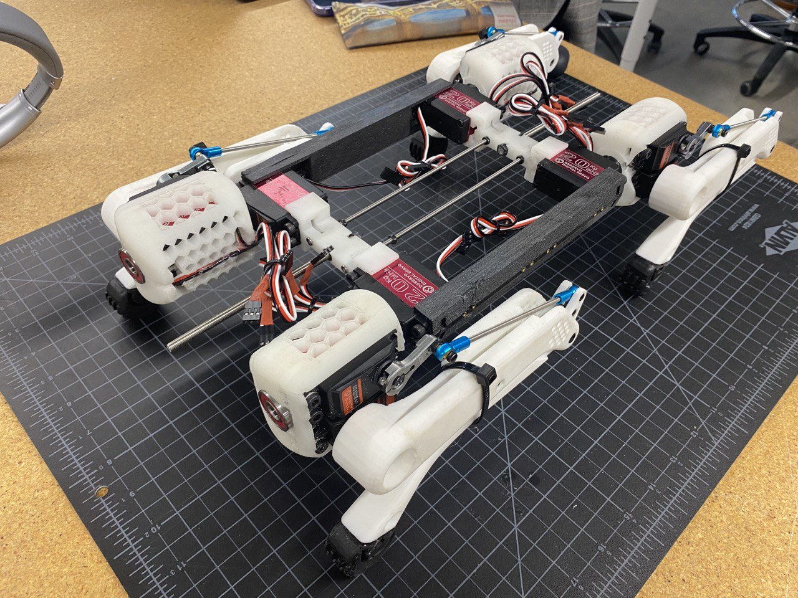
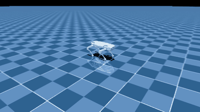
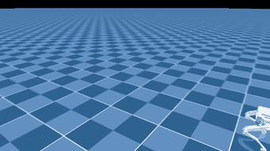
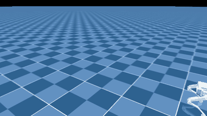
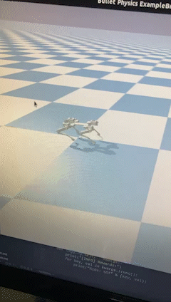

# Gray

**A 12-DOF quadruped robot.** Two students designed it, printed it, and built it.
The software teaches it to walk with reinforcement learning.



The robot is built. The parts are apart on a shelf. The work now is in simulation:
teach it to walk, teach it to stand up, then put the policy on the real machine.

---

## What it can do today

Every number below is measured in simulation, on 64 robots, over 25 seconds.
Nothing here is an estimate.

| | measured | it must reach |
|---|---|---|
| Walks forward | 6.7 m | 5.0 m |
| Top speed | 0.72 m/s — 2.6 km/h | — |
| Holds a straight line | 4.5° off | 7° |
| Turns on the spot | within 0.23 rad/s | 0.45 rad/s |
| Stays upright | 100 of 100 attempts | 90 |
| Climbs a 10° slope | 98 of 100 stay up | — |
| **Criteria passed** | **10 of 11** | 11 |

The one criterion left is the sideways walk. It misses by 3 mm/s.

Two policies made this table. The flat policy holds the line and the speed. A second
policy, trained on hills, does the climb. Hills and a straight walk pull against each
other: train on slopes and the line costs about 1.7° more. One policy for both is the
next decision, not a finished result.

---

## The robot

| | |
|---|---|
| Joints | 12 — three per leg |
| Servos | 12 × DS3218MG, 1.96 N·m, 270° |
| Mass | 3.1 kg |
| Sensors | 3 IMUs on the trunk, a potentiometer on every joint |
| Computer | Raspberry Pi, with an external ADC for the potentiometers |

**Three hardware facts change how the software must work.**

- The knee is a pushrod linkage. The servo angle is **not** the joint angle. A linear
  potentiometer on the rod measures the true knee angle.
- The servos take PWM at 50 Hz. That is the control ceiling. Feedback changes what the
  robot can sense, not how fast it can move.
- Only four servos sit in the body. Eight sit in the hip modules. The thigh and the calf
  hold no servo at all. This sets how heavy a leg is to swing.

---

## How to run it

Start two processes, in two terminals. Each one continues if you close the other.

```
python run.py              the training centre, at http://127.0.0.1:8000
python run.py --runner     works through the queue, unattended
```

Put jobs in the queue from the dashboard. The runner does them, one at a time.
Each job is **train**, then **verify**, then **film**.

Two training processes on one graphics card stop each other. So the runner takes one
job at a time, and that rule is structural rather than something to remember.

> ### Caution
> **Do not open a simulator window while a run trains.** A second process on the same
> card once stopped the machine and lost the run. This includes `Playground/pilot.py`,
> `scripts/drive.py`, and `find_stance.py --render`.
> The dashboard is safe. It uses the CPU only.

### Other commands

| | |
|---|---|
| `python run.py --check` | what the dashboard can see, then exit |
| `python scripts/train.py Gray-Walk --iterations 3000` | train one policy by hand |
| `python scripts/verify.py Gray-Walk` | score a policy against its criteria |
| `python scripts/scale_test.py` | how many robots this card can hold |
| `python Playground/pilot.py --run <run> --playground` | drive a trained policy yourself |
| `python tools/prepare_model.py "sim/URDF and Meshes V2"` | rebuild the model from CAD |

The three tasks are `Gray-Stand`, `Gray-Push` and `Gray-Walk`.

---

## Where to read more

| | |
|---|---|
| [PLAN.md](PLAN.md) | the stages, and the number each stage must reach |
| [RULES.md](RULES.md) | the decisions that hold across the project, and why |
| [CLAUDE.md](CLAUDE.md) | the hardware facts that do not change |
| [docs/REWARDS.md](docs/REWARDS.md) | what each reward term pays for |
| [Playground/README.md](Playground/README.md) | how to drive a policy by hand |

The dashboard holds more than these files do. It reads the live code, so it cannot
disagree with what the robot actually trained on.

---

## The machine

**The CAD model, and the URDF the simulation reads.**

 

**The build.** The controller, the legs, and the body with its electronics.

  

**The first walk tests on the real robot.**


**In simulation.** Run 182, the most recent walk run, at three points in its training.
Each clip is 8 seconds. The camera follows the robot and holds the start of the walk
in shot, so the ground shows how far the robot moved.

  

Run 182 tests a penalty that holds the hips near their home angle. It did not pass the
walk criteria. These clips show the newest policy, not the best one. The table at the
top of this page comes from two other policies.

**The earlier attempt**, at three points in its training. This software stack used a bad
CAD export, and the git tag `archive/attempt-1` holds it. The robot in these clips is the
old model.

  

---

## Contributors

- Ibrahim Eren Bisen
- Emin Alp Arslan
