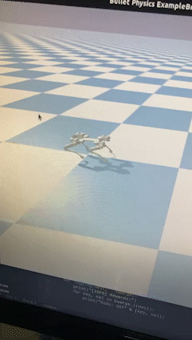

# Gray
A quadruped robot trained with reinforcement learning.
##About

##CAD Modelling

##Manufacturing

##Simulation
These are couple of Gifs showing the progress that has been done by the machine learning algorithm we are using throughout time.

Currently WIP.

## Contributors:
 - Ibrahim Eren Bisen
 - Emin Alp Arslan
